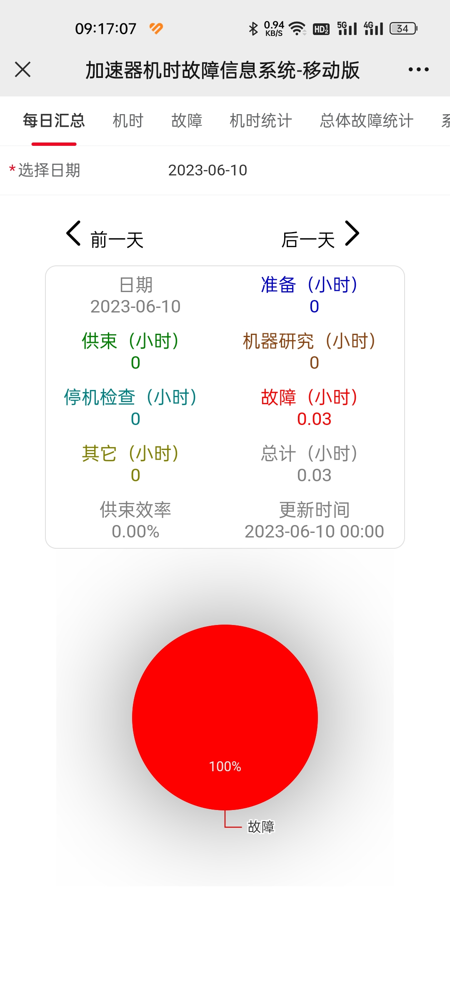
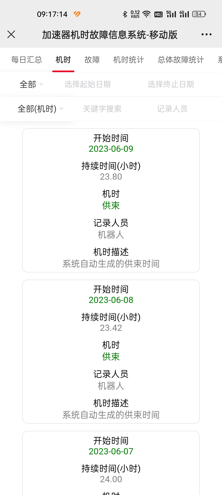
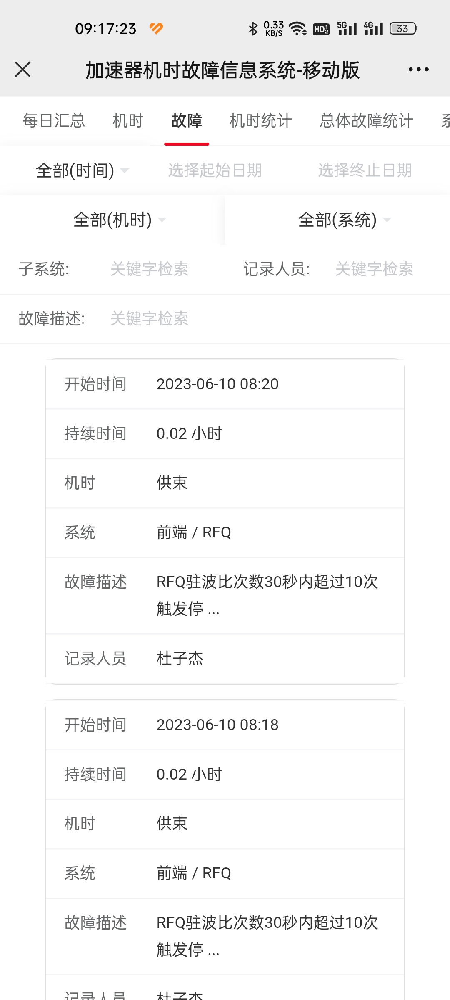
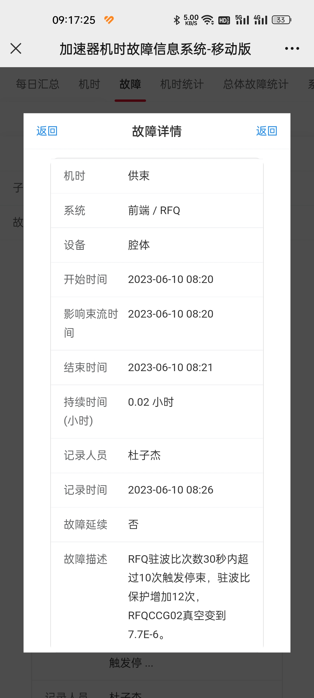
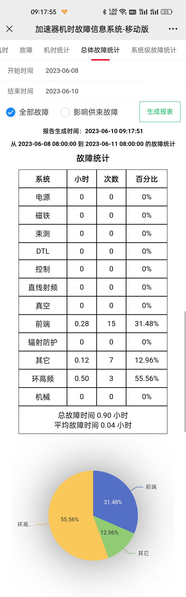
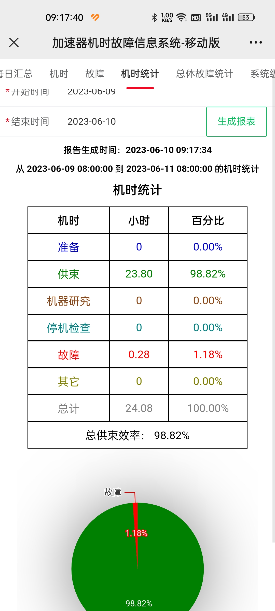

# 加速器机时故障系统移动版

本仓库为机时故障系统移动端的展示版本，因单位保密需要，此仓库不包含系统源代码，仅包含系统部署步骤及系统展示图片。

## 系统效果展示

     


## 后端部署


### 安装JDK1.8

1. 输入命令：

   `sudo apt-get install openjdk-8-jre`

   等待安装完成，完成后输入**java -version**可验证是否安装成功。


### SpringBoot配置


1. 更改**application.yml**下的**spring.profiles.active**

```yaml
spring:
  # 环境 dev|test|prod
  profiles:
    active: dev
```

2. 更改**application-\*\*\*.yml**下的**spring.datasource.druid.url**以及**username**和**password**

```yaml
spring:
    datasource:
        type: com.alibaba.druid.pool.DruidDataSource
        druid:
            driver-class-name: com.mysql.jdbc.Driver
            url: jdbc:mysql://10.1.62.56:3306/operation_summary?characterEncoding=utf-8&useSSL=false&serverTimezone=Asia/Shanghai
            username: control
            password: 123456
```

3. 输入**mvn clean package**打包上传服务器即可。
3. 输入 **nohup java -jar breakdown_backend.jar >log.txt &**，让程序后台运行。


## 前端部署


### Vue配置

vue不用配置，输入**npm run build**命令即可。输入命令后vue项目根目录下会生成一个**dist**文件夹。把**dist**文件夹下文件传输到**/usr/share/nginx/html/**下，即/dist/index.html出现在/usr/share/nginx/html/index.html。没有npm命令需要安装Node.js和npm，开发环境下的node.js版本为12.14.0，npm版本为6.13.4。


### 安装nginx


1. 输入命令：

   `sudo apt install nginx`

2. 输入以下命令检查nginx是否安装成功，或者在地址栏输入ip地址。

   `sudo systemctl status nginx`

   若输入命令后有对应显示，或在地址栏上输入ip地址后能访问，则说明安装成功。

3. 进入**/etc/nginx/conf.d**目录，若没有**default.conf**文件，则创建一个。

4. 把**/dist目录下**的文件传输到**/usr/share/nginx/html/**下，即/dist/index.html出现在/usr/share/nginx/html/index.html。

5. 修改/etc/nginx/conf.d下的**default.conf**，把以下内容复制进去，注意把**location /api/ **下的**proxy_pass** ip地址修改为后端springboot所在的地址：

   ```
   server {
       listen       80;
       listen  [::]:80;
       server_name  localhost;
   
       #access_log  /var/log/nginx/host.access.log  main;
   
       location / {
           root   /usr/share/nginx/html;
           index  index.html index.htm;
       }
   
       #error_page  404              /404.html;
   
       # redirect server error pages to the static page /50x.html
       #
       error_page   500 502 503 504  /50x.html;
       location = /50x.html {
           root   /usr/share/nginx/html;
       }
   
       location /api/ {
           proxy_pass http://10.1.62.215:12345/;
       }
   
       # proxy the PHP scripts to Apache listening on 127.0.0.1:80
       #
       #location ~ \.php$ {
       #    proxy_pass   http://127.0.0.1;
       #}
   
       # pass the PHP scripts to FastCGI server listening on 127.0.0.1:9000
       #
       #location ~ \.php$ {
       #    root           html;
       #    fastcgi_pass   127.0.0.1:9000;
       #    fastcgi_index  index.php;
       #    fastcgi_param  SCRIPT_FILENAME  /scripts$fastcgi_script_name;
       #    include        fastcgi_params;
       #}
   
       # deny access to .htaccess files, if Apache's document root
       # concurs with nginx's one
       #
       #location ~ /\.ht {
       #    deny  all;
       #}
   }
   ```

6. 重启nginx服务：

   `nginx -s reload`

   <font color='red'>注意：如果打开/etc/nginx/nginx.conf文件后看到类似</font>

   	include /etc/nginx/conf.d/*.conf;
   	include /etc/nginx/sites-enabled/*;
   <font color='red'>的两行代码块，删去一个不需要的即可，例如我把第二行注释掉，只保留/etc/nginx/conf.d/default.conf：</font>
   
   ```
   include /etc/nginx/conf.d/*.conf;
   # include /etc/nginx/sites-enabled/*;
   ```
   
   <font color='red'>然后输入nginx -s reload重启nginx服务即可</font>
